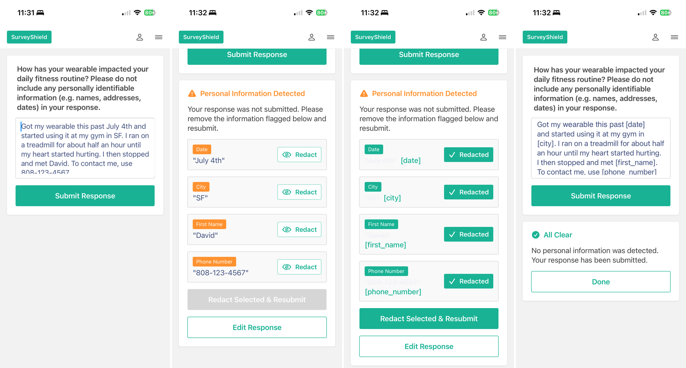

# SurveyShield iOS
### On-Device PII Screening for Survey Responses, powered by OpenMed

A native iOS app that screens open-text survey responses for personally identifiable information before the response is ever submitted. Detection and redaction run entirely on the device using OpenMed's clinical NER models through the OpenMedKit Swift framework. No response text leaves the phone at any point in the flow.

---

## What This Builds

Health and wellness studies pair wearable device metrics with a handful of open-text survey questions. Most responses are clean, but some participants type something they shouldn't: their own name, a family member's details, a phone number, a home city, a date. Catching that before the data reaches an analyst is normally a manual skim that does not hold up once a study runs past a few participants.

SurveyShield moves that check to the point of entry. When a participant submits a response, an on-device model scans the text, classifies each detected identifier by confidence, and holds the submission until the flagged spans are redacted. The participant sees exactly what was found and confirms the redaction themselves.

**Four core capabilities:**

1. **On-Device Survey Capture**: a SwiftUI survey form styled after a standard research questionnaire; the participant answers a wearable fitness question in free text, with a reminder not to include identifying details
2. **Confidence-Tiered PII Detection**: on submit, OpenMed's PII model classifies each span (first name, city, date, phone number, and more) with a confidence score; spans above the auto-redact threshold are surfaced for one-tap redaction, weaker spans are held for review, and the submission is blocked until they are cleared
3. **Span-Level Redaction**: each flagged identifier is replaced in place with a labeled placeholder such as `[date]`, `[city]`, `[first_name]`, or `[phone_number]`, leaving the rest of the response intact so the survey content stays usable
4. **Clean-Response Confirmation**: once every identifier is redacted, a re-scan confirms the text is clear and the response is submitted; a response that carries no PII from the start passes straight through



---

## Setup

```bash
# 1. Clone the repo
git clone https://github.com/alex-sajnani/SurveyShield-iOS.git
cd SurveyShield-iOS

# 2. Open the project in Xcode
open SurveyShield.xcodeproj

# 3. Build and run on an iOS Simulator (Cmd R)
```

The OpenMedKit dependency is vendored under `Vendor/OpenMedKit`, so there is no package resolution step to run first. On the first scan the app downloads the MLX model snapshot to the local cache, then runs fully offline after that.

Requirements:
- Xcode 15 or newer
- iOS 17 or newer (OpenMedKit targets iOS 17)
- Apple Silicon Mac for the MLX runtime in the Simulator

**Model:** the app pins `OpenMed/OpenMed-PII-LiteClinical-Small-66M-v1-mlx`, a 66M-parameter PII model, downloaded on demand through `OpenMedModelStore`.

---

## Architecture

The scan pipeline is a straight line: capture the response, detect identifiers, decide what to redact versus hold, replace the redacted spans, and re-scan to confirm. The redaction decision is driven by the confidence score attached to each detection, not by the label alone.

| Layer | Technology | Role |
|-------|-----------|------|
| UI | SwiftUI (`SurveyShieldApp.swift`) | The survey form, the detection card, the one-tap redaction controls, and the confirmation screen |
| Scan orchestration | `PIIScanner` (Swift) | Loads the model on first use, calls `extractPII`, applies the policy, and returns the redacted text plus a review flag |
| Redaction policy | `RedactionPolicy` (Swift) | Maps each entity label to a redaction method and holds the auto-redact and review confidence thresholds |
| On-device inference | OpenMedKit `OpenMed.extractPII` | Runs the PII token-classification model and returns a label, span offsets, and a confidence score per entity |
| Runtime | Apple MLX (with a CoreML fallback path in OpenMedKit) | Executes the model on-device; no remote inference endpoint is contacted |
| Model store | `OpenMedModelStore` | Downloads and caches the MLX model snapshot from Hugging Face on first scan |

**Two guardrails the code enforces on every scan:**

- Spans already wrapped in brackets from a previous pass, like `[date]`, are skipped so a redacted response is never flagged a second time on re-scan.
- Labels with no identifying value on their own, such as `time` (durations like "30 minutes"), are suppressed by the policy rather than shown to the participant.

---

## Project Structure

```
SurveyShield-iOS/
├── SurveyShield/
│   ├── SurveyShieldApp.swift     # App entry point, ContentView, survey UI, redaction flow
│   ├── PIIScanner.swift          # Scan orchestration: model load, extractPII, redaction, re-scan guards
│   ├── Models.swift              # RedactionPolicy, PIIEntity, RedactionResult, SurveyQuestion
│   ├── Info.plist
│   └── Assets.xcassets/          # App icon and in-app screenshots
├── Vendor/
│   └── OpenMedKit/               # Vendored OpenMed Swift framework (MLX + CoreML backends, policy resources)
├── Tests/
├── assets/                       # README demo animation
├── SurveyShield.xcodeproj
├── PRD.md                        # Product requirements for the parent SurveyShield project
└── README.md
```

OpenMedKit ships its own test suite under `Vendor/OpenMedKit/Tests/OpenMedKitTests` (policy loading, MLX inference, post-processing, and de-identification result serialization).

---

## Key Design Decisions

**The block happens before submission, not after.**
A response carrying PII is never accepted and then cleaned up later. The submission is held on the device, the participant is shown each identifier that was found, and nothing is recorded until they redact the flagged spans and a re-scan comes back clean. The person who typed the identifier is the one who removes it, so no downstream reviewer inherits raw PII.

**Confidence decides the action, not just the label.**
The model returns a confidence score with every detection, and the policy carries two thresholds. A detection above `autoRedactThreshold` (0.75) is offered for one-tap redaction; a weaker detection above `reviewThreshold` (0.55) still blocks the submission and is held for a person to look at; anything below 0.55 is treated as noise. The thresholds were set against confidences actually observed on-device (phone numbers near 0.78, dates near 0.84), so those real cases land in the auto-redact tier instead of being missed.

**Redaction is span-level, not whole-cell.**
Only the identified identifier is replaced, using its character offsets from the scan. `"...my gym in SF..."` becomes `"...my gym in [city]..."`, leaving the surrounding answer readable. A study analyst still gets a usable response, minus the identifier.

**Re-scanning cannot re-flag its own output.**
After redaction the text is scanned again to confirm it is clean. Placeholders like `[city]` are detected and skipped by offset, so the confirmation pass reflects what the model still finds in the participant's own words rather than reacting to the labels the app just inserted.

**OpenMedKit is vendored, not fetched.**
The framework lives in-repo under `Vendor/OpenMedKit` because the upstream root manifest omitted the `resources:` declaration that `Bundle.module` needs to load the bundled policy files. Vendoring keeps the build reproducible; the plan is to drop the copy and point back at the remote package once upstream ships the fix.

---

## Model and Policy Context

The app screens a wearable fitness survey. The question is domain-specific to wearable research, but the scan-and-redact flow generalizes to any open-text survey.

**Detection model:** `OpenMed/OpenMed-PII-LiteClinical-Small-66M-v1-mlx`, running on Apple MLX. Entity labels follow the OpenMed PII vocabulary in snake_case (`first_name`, `phone_number`, `city`, `date`), not generic tags like `PERSON`.

**Redaction policy (`RedactionPolicy.buildDefault`):**

| Setting | Value | Meaning |
|---------|-------|---------|
| `autoRedactThreshold` | 0.75 | At or above this confidence, a span is offered for one-tap redaction |
| `reviewThreshold` | 0.55 | Between review and auto-redact, a span blocks submission and is held for review |
| `suppressedLabels` | `time` | Labels with no standalone identifying value, hidden from the participant |
| Default method | `mask` | Redacted spans are replaced with a labeled placeholder such as `[phone_number]` |

OpenMedKit also ships nine reference de-identification policy files (HIPAA Safe Harbor, HIPAA expert-review, GDPR pseudonymization, GDPR Article 9 health data, Canada PIPEDA, Australia Privacy Act, a research limited dataset, clinical minimal redaction, and a strict no-leak profile) under `Vendor/OpenMedKit/Sources/OpenMedKit/Resources/policies`, available for teams that need a named regulatory profile.

---

## Evaluation Results

The detection pipeline was measured against 300 synthetic survey responses seeded with 72 planted identifiers, using the exact model weights and policy thresholds the app ships with.

| Metric | Result |
|---|---|
| Recall (PII caught) | 97% |
| Precision (flags that were real PII) | 97% |
| Automated code tests | 31 of 31 passing |

Suppressing non-identifying `time` labels (e.g. "30 minutes") removed nearly all false alarms without dropping any real detections, and confidence-based routing kept borderline cases in front of a person instead of acting on them automatically. Full methodology, per-label breakdowns, and reproduction steps are in [`evaluation/RESULTS.md`](evaluation/RESULTS.md).

---

## Roadmap

This iOS app is the on-device field-screening phase of the parent SurveyShield project. Planned next steps, carried over from `PRD.md`:

- **Multi-language screening** using OpenMed's supported PII language codes, with a per-site policy so a study running across countries applies locale-appropriate redaction.
- **Active-learning review loop** that logs each redaction decision and recalibrates the review threshold over time.

---

## Credits and Citation

SurveyShield iOS runs on **OpenMed** models via the **OpenMedKit** Swift framework, both by Maziyar Panahi and released under Apache-2.0. Repository: [github.com/maziyarpanahi/openmed](https://github.com/maziyarpanahi/openmed).

If you use OpenMed in published work, cite the paper as the project asks:

```bibtex
@misc{panahi2025openmedneropensourcedomainadapted,
      title={OpenMed NER: Open-Source, Domain-Adapted State-of-the-Art Transformers for Biomedical NER Across 12 Public Datasets},
      author={Maziyar Panahi},
      year={2025},
      eprint={2508.01630},
      archivePrefix={arXiv},
      primaryClass={cs.CL},
      url={https://arxiv.org/abs/2508.01630},
}
```

- OpenMed repository: https://github.com/maziyarpanahi/openmed
- OpenMedKit (Swift): https://github.com/maziyarpanahi/openmed/tree/master/swift/OpenMedKit
- OpenMed NER paper: https://arxiv.org/abs/2508.01630

Portions of this codebase were developed with assistance from [Claude Code](https://claude.com/claude-code).
